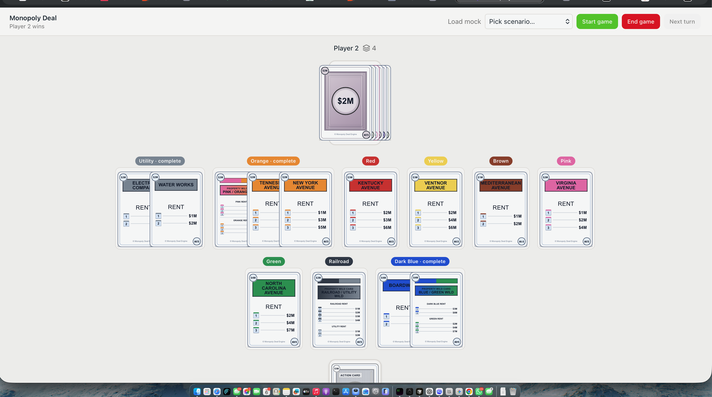

# AI Monopoly Deal



This is a Python 3.13+ learning project for building a Monopoly Deal engine and,
eventually, an AI player that can choose strong legal moves.

## What Is Monopoly Deal?

[Monopoly Deal](https://en.wikipedia.org/wiki/Monopoly_Deal) is a fast card-game
version of Monopoly. Players build property sets, bank money, charge rent, play
action cards, and try to be the first player with three complete property sets.

This project currently has:

- A rules engine for two-player Monopoly Deal.
- A model of the full 106-card deck.
- Turn flow for drawing, playing up to three cards, discarding, and ending turns.
- Action cards, rent and debt payments, interrupts, and Just Say No chains.
- Legal move enumeration through `Game.legal_moves()`.
- Serialization for game state, cards, and moves.
- Rollout and MCTS code for AI experiments.
- A FastAPI backend and React frontend for playing games.

The engine is the foundation. AI work should depend on legal game states and
legal moves from the engine rather than re-implementing rules elsewhere.

## MCTS And ISMCTS

The AI side of this project treats Monopoly Deal as a sequential decision
problem: an agent observes a game state, chooses an action, receives outcomes,
and tries to improve future decisions. That framing follows the reinforcement
learning view introduced in Sutton and Barto's
*[Reinforcement Learning: An Introduction](https://mitpress.mit.edu/9780262039246/reinforcement-learning/)*.

Monte Carlo Tree Search (MCTS) is a decision-time search method. Instead of
trying to solve the whole game tree exactly, it repeatedly simulates possible
future games, grows a search tree around promising actions, and uses the rollout
results to balance exploration with exploitation. For this repository, MCTS is a
natural first AI approach because the engine can enumerate legal moves and apply
them through commands.

Monopoly Deal also has hidden information: each player cannot see the other
player's hand. Information Set Monte Carlo Tree Search (ISMCTS) adapts MCTS to
that setting by searching over information sets: groups of possible game states
that are indistinguishable from the acting player's point of view. The main
reference is Cowling, Powley, and Whitehouse's 2012 paper,
*[Information Set Monte Carlo Tree Search](https://doi.org/10.1109/TCIAIG.2012.2200894)*.

## Running The Project

Install Python dependencies from the repository root:

```bash
uv sync
```

Run all Python tests:

```bash
python -m unittest discover -s . -p 'test_*.py'
```

Run one Python test module:

```bash
python -m unittest models.game.tests.test_legal_moves
```

Start the API:

```bash
uv run serve --reload
```

API docs are available at:

```text
http://127.0.0.1:8000/docs
```

Start the web client in a second terminal:

```bash
cd web
npm install
npm run dev
```

Open:

```text
http://localhost:5173
```

The web client proxies `/games` to `http://127.0.0.1:8000` by default.

## Repository Structure

- `api/`: FastAPI routes, schemas, service layer, and in-memory game storage.
- `mcts/`: Monte Carlo Tree Search nodes, solver code, and determinization.
- `models/`: Core game engine, cards, players, commands, legal moves, and tests.
- `rollout/`: Rollout policies and simulation helpers for AI experiments.
- `serialization/`: Conversion helpers for cards, moves, and game state.
- `web/`: React and Vite frontend for playing against the AI.
- `AGENTS.md`: Guidance for coding agents working in this learning project.
- `pyproject.toml`: Python package metadata, dependencies, and script entries.

## References

- Richard S. Sutton and Andrew G. Barto,
*[Reinforcement Learning: An Introduction*, second edition](https://mitpress.mit.edu/9780262039246/reinforcement-learning/),
MIT Press, 2018.
- Peter I. Cowling, Edward J. Powley, and Daniel Whitehouse,
*[Information Set Monte Carlo Tree Search](https://doi.org/10.1109/TCIAIG.2012.2200894)*,
IEEE Transactions on Computational Intelligence and AI in Games, 4(2),
120-143, 2012.
