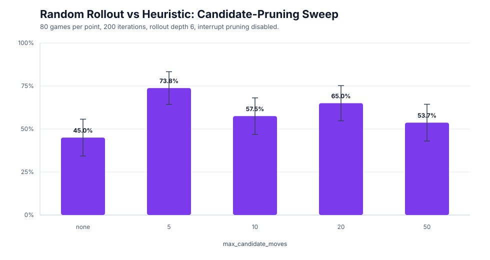
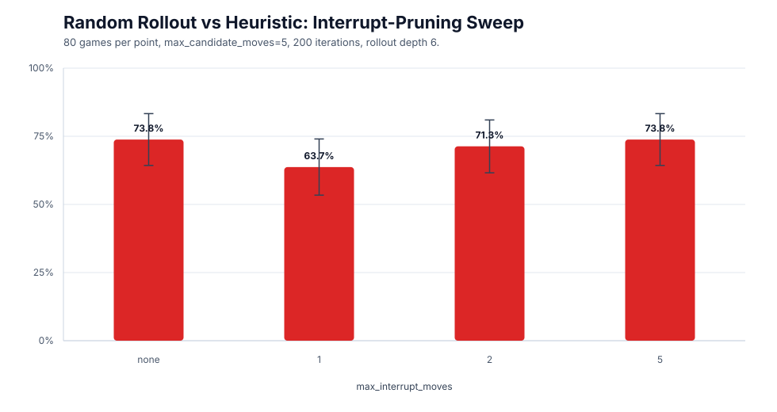
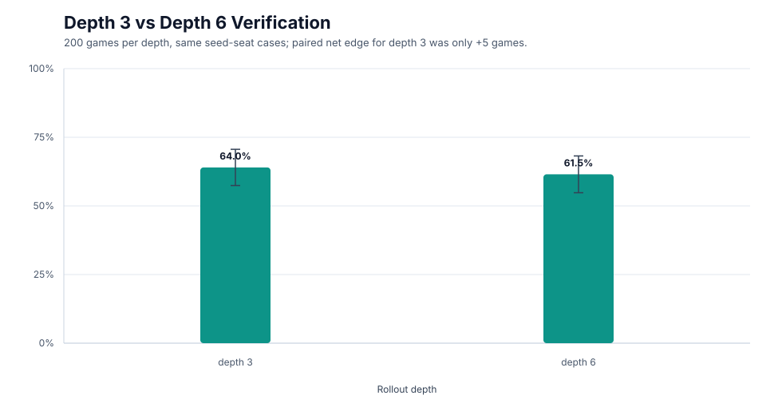

# MCTS Experiment Report

## Bottom Line

The current MCTS agent is mostly limited by its **move prior / pruning layer**,
not by rollout depth.

The clearest result is from random-rollout MCTS against the heuristic opponent:

```text
no pruning:             36/80 = 45.0%
candidate cap 5:        59/80 = 73.8%
candidate cap 20:       52/80 = 65.0%
candidate cap 50:       43/80 = 53.7%
```

That means the handcrafted move ranking is doing real work. The next useful AI
step is a better move-ranking prior, not deeper random rollouts.

## What We Can Act On

1. **Candidate pruning is the strongest lever.**

   Aggressive candidate pruning made random-rollout MCTS competitive against the
   heuristic opponent. Without pruning, random-rollout MCTS lost.

2. **`max_candidate_moves=5` is the best observed candidate cap.**

   This is not yet a permanent default, but it is the strongest experimental
   setting so far and should be the next setting to verify on larger seed blocks.

3. **`max_interrupt_moves=1` is too aggressive.**

   It hurt performance. Use `2`, `5`, or no interrupt pruning until losing-seed
   analysis shows a better reason to narrow interrupts.

4. **Depth `3` is not proven stronger than depth `6`.**

   In the 200-game direct verification, depth `3` was only slightly ahead.
   This is not statistically convincing. Depth `3` is reasonable if we want a
   small speed win, but not because it is clearly stronger.

5. **Full terminal rollouts are not worth prioritizing.**

   They were slower and unstable across seed blocks.

## Candidate Pruning

Random-rollout MCTS vs heuristic opponent, `200` iterations, rollout depth `6`,
interrupt pruning disabled unless noted.



| Candidate cap | Games | MCTS wins | Win rate | Use this result?                            |
| ------------- | ----- | --------- | -------- | ------------------------------------------- |
| none          | 80    | 36        | 0.450    | Yes: rules out unguided random-rollout MCTS |
| 5             | 80    | 59        | 0.738    | Yes: strongest observed cap                 |
| 10            | 80    | 46        | 0.575    | Mostly ruled out                            |
| 20            | 80    | 52        | 0.650    | Useful baseline                             |
| 50            | 80    | 43        | 0.537    | Mostly ruled out                            |


Paired seed/seat deltas:


| Comparison                  | Paired effect           |
| --------------------------- | ----------------------- |
| candidate 5 vs no pruning   | +23 net games out of 80 |
| candidate 20 vs no pruning  | +16 net games out of 80 |
| candidate 5 vs candidate 20 | +7 net games out of 80  |
| candidate 5 vs candidate 50 | +16 net games out of 80 |


Interpretation: the top-K move prior is doing more than speeding up search. It
is directly improving move quality.

Raw summary:

`/private/tmp/monopoly-pruning-candidate-sweep/20260609_181901/candidate_cap_sweep_summary.csv`

## Interrupt Pruning

Candidate cap fixed at `5`.



| Interrupt cap | Games | MCTS wins | Win rate | Use this result? |
| ------------- | ----- | --------- | -------- | ---------------- |
| none          | 80    | 59        | 0.738    | Good baseline    |
| 1             | 80    | 51        | 0.637    | Rule out for now |
| 2             | 80    | 57        | 0.713    | Acceptable       |
| 5             | 80    | 59        | 0.738    | Acceptable       |


Interpretation: interrupt cap `1` throws away too much. The safer settings are
`2`, `5`, or no interrupt pruning.

Raw summary:

`/private/tmp/monopoly-pruning-interrupt-sweep/20260609_182731/candidate5_interrupt_sweep_summary.csv`

## Rollout Depth

The only depth result worth using for decisions is the direct depth `3` vs depth
`6` verification on the same 200 seed/seat cases.



| Rollout depth | Games | MCTS wins | Win rate | 95% half-width | Elapsed |
| ------------- | ----- | --------- | -------- | -------------- | ------- |
| 3             | 200   | 128       | 0.640    | 0.066          | 372.8s  |
| 6             | 200   | 123       | 0.615    | 0.067          | 407.8s  |


Paired comparison:


| Result class     | Count |
| ---------------- | ----- |
| Both depths won  | 88    |
| Depth 3 only won | 40    |
| Depth 6 only won | 35    |
| Both depths lost | 37    |


```text
paired difference = +0.025 for depth 3
95% CI ~= -0.060 to +0.110
```

Interpretation: depth `3` is slightly faster and slightly ahead, but the
strength edge is not verified.

Raw files:

- `/private/tmp/monopoly-depth-verify/depth_3/mcts_policy_20260609_164308.txt`
- `/private/tmp/monopoly-depth-verify/depth_6/mcts_policy_20260609_165009.txt`

## Ruled Out Or De-Emphasized

These runs are intentionally not part of the main argument:

- **Low-iteration probes** such as 10, 20, and 50 iterations. They were useful
  for smoke testing, but too noisy for design decisions.
- **Random-opponent results.** They confirm the agent can beat weak play, but do
  not tell us how to beat the heuristic baseline.
- **Small policy matrices.** They motivated the later ablations but were too
  small to use as final evidence.
- **Full terminal rollouts.** They were slow and seed-sensitive.
- **Claim that depth `3` is clearly stronger than depth `6`.** The 200-game
  verification did not support that claim.

## Recommended Next Step

Do not jump straight to an AlphaGo-style policy net. First make the move prior
explicit and measurable.

1. Introduce a `MovePrior` interface.

   ```text
   legal moves -> move prior -> candidate selector -> MCTS
   ```

2. Turn the current `move_scoring.py` logic into `HeuristicMovePrior`.

3. Add candidate-pruning recall diagnostics:

   - legal move count,
   - heuristic baseline move rank,
   - MCTS selected move rank,
   - whether candidate cap `5` pruned plausible winning moves,
   - win/loss outcome for the game.

4. Use those diagnostics to build a training set for a learned move-ranking
   prior.

The learned model should first replace or augment `score_move`. That is the
right bridge toward policy learning without overbuilding a full AlphaGo-style
system prematurely.
